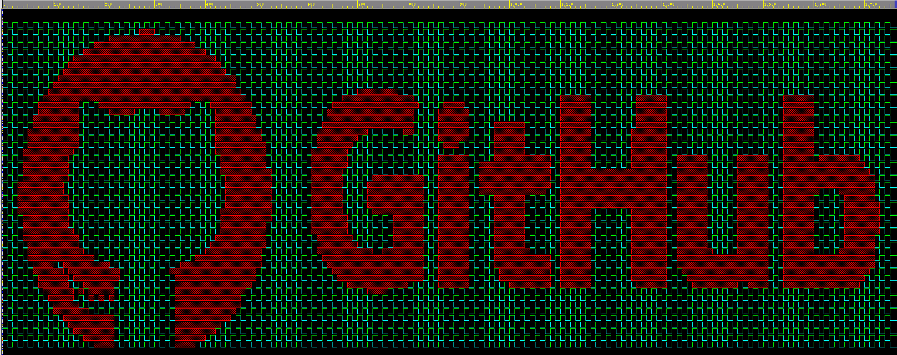
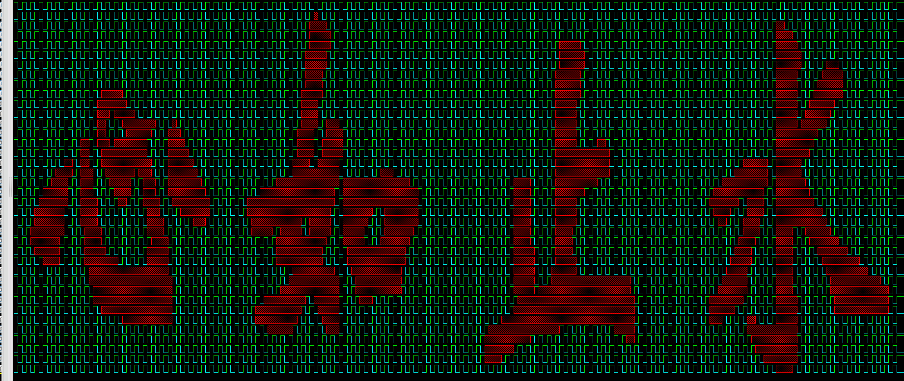

# 准备

PIL库： **pip install pillow** 安装

准备`pattern.txt`，由0，1组成。有两种获取方法：

1. 对于汉字，可以在[点阵字](http://life.chacuo.net/convertfont2char)页面上生成，生成后保存到`pattern.txt`。注意替换掉网页字体的格式！

2. 对于图形，可以保存为图片，然后执行`gen_pattern.py`，生成`pattern.txt`。

# 使用
根据`pattern.txt`的行列数，配置`makefile`中的**WIDTH** **HEIGHT**参数

**make run**运行仿真，生成波形

**make wave**打开波形

拉取信号`val`查看即可

## 示例

